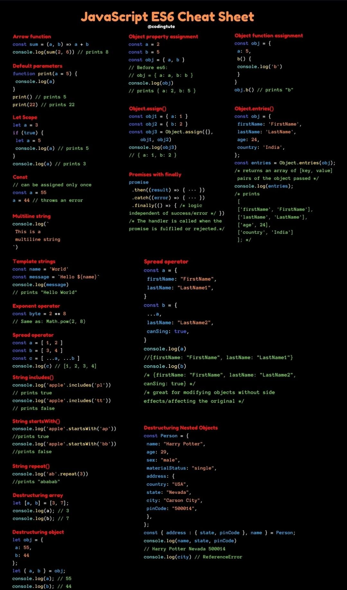

## JAVASCRIPT

### MODERN JAVASCRIPT



### MEDIA QUERIES MY STANDAR

```       
if (window.matchMedia("(min-width: 300px)").matches && window.matchMedia("(max-width: 480px)").matches){ 
    console.log('Match 300px - 480px')
}else
if (window.matchMedia("(min-width: 481px)").matches && window.matchMedia("(max-width: 768px)").matches){
  console.log('Match 481px - 768px')
}else
if (window.matchMedia("(min-width: 769px)").matches && window.matchMedia("(max-width: 992px)").matches){
  console.log('Match 769px - 992px')
}else
if (window.matchMedia("(min-width: 992px)").matches && window.matchMedia("(max-width: 1024px)").matches){
  console.log('Match 769px - 1024px')
}else
if (window.matchMedia("(min-width: 1025px)").matches && window.matchMedia("(max-width: 1200px)").matches){
  console.log('Match 1025px - 1200px')
}else
if (window.matchMedia("(min-width: 1201px)").matches && window.matchMedia("(max-width: 1279px)").matches){
    console.log('Match 1201px - 1279px')
}else
if (window.matchMedia("(min-width: 1280px)").matches && window.matchMedia("(max-width: 1919px)").matches){
    console.log('Match 1280px - 1919px')
}else
if (window.matchMedia("(min-width: 1920px)").matches) {
    console.log('Match 1920px')
}
```

### COOKIES

```
function createCookie(name, value, days) {
    let expires = ''
    let date = ''
    if(days) {
        date = new Date();
        date.setTime(date.getTime() + (days * 24 * 60 * 60 * 1000))
        expires = "; expires=" + date.toGMTString();
    }else {
        expires = ""
    }
    document.cookie = name + "=" + value + expires + "; path=/"
  }

function readCookie(name) {
    let nameCookie = name + "="
    let cookieValues = document.cookie.split(';')
    for (var i = 0; i < cookieValues.length; i++) {
        let getCookieValue = cookieValues[i]
        while (getCookieValue.charAt(0) == ' ') getCookieValue = getCookieValue.substring(1, getCookieValue.length)
        if (getCookieValue.indexOf(nameCookie) == 0) {
            return decodeURIComponent(getCookieValue.substring(nameCookie.length, getCookieValue.length))
        }
    }
    return null;
}

if(readCookie('example') === null || readCookie(example) === 'null'){
    createCookie('example', 'This is example', 30)
}
```

### Slider (Reutilizable)

```
<div class="element-flex element-position-relative element-width-fit-content" id="element_slider">
    <div class="element-slider-item">
        
    </div>
    <div class="element-slider-item">
        
    </div>
    <div class="element-slider-item">
        
    </div>
    <div class="element-slider-item">
        
    </div>
    <div class="element-button-slider-previus">
        <button id="element-slider-previus"><i class="fa fa-caret-left" aria-hidden="true"></i></button>
    </div>
    <div class="element-button-slider-next">
        <button id="element-slider-next"><i class="fa fa-caret-right" aria-hidden="true"></i></button>
    </div>
</div>
                
// SEARCHS ALL SLIDERS OF DOM
let getSliderContainer = document.querySelectorAll('#element_slider')
let maxSlider = 0
for (let index = 0; index < getSliderContainer.length; index++) {
    const sliderContainer = getSliderContainer[index];
    let getSliderItem = sliderContainer.querySelectorAll('.element-slider-item')
    maxSlider = getSliderItem.length - 1   
    let positionSlider = 1

    //INIT SLIDERS
    slider(null,getSliderItem)
    
    //BUTTON PREVIUS SLIDER
    sliderContainer.querySelector('#element-slider-previus').addEventListener('click', () =>{
        if(positionSlider >= 1 && positionSlider <= maxSlider){
            slider(positionSlider = positionSlider - 1, getSliderItem)
        }
    })
    //BUTTONS NEXT SLIDER
    sliderContainer.querySelector('#element-slider-next').addEventListener('click', () =>{
        if(positionSlider >= 0 && positionSlider < maxSlider){
            slider(positionSlider = positionSlider + 1 ,getSliderItem)
        }
    })
}

//FUNCTION
function slider(sliderNumberItem, sliderChilds){
    let getSliderItem = sliderChilds
    if(sliderNumberItem == null){
        getSliderItem.forEach((slider, index) => {
            if(index == 0 ){
                slider.style.display = "block"
            }else{
                slider.style.display = "none"
            }
        });
    }else
    if(sliderNumberItem != null){  
        getSliderItem.forEach((slider, index) => {
            if(index == sliderNumberItem ){
                slider.style.display = "block"
            }else{
                slider.style.display = "none"
            }
        });
    }
}
```
### Debouncing

Debouncing in JavaScript is a practice used to improve browser performance. There might be some functionality in a web page which requires time-consuming computations. If such a method is invoked frequently, it might greatly affect the performance of the browser, as JavaScript is a single threaded language. Debouncing is a programming practice used to ensure that time-consuming tasks do not fire so often, that it stalls the performance of the web page. In other words, it limits the rate at which a function gets invoked.

Example

```
<button id="button">Debounce</button>

<script>
let button = document.querySelector('#button');
let debounceTiempo;

const message = ()=> {
	alert('hello world');
}

const debounce = (callback, time) => {
  clearTimeout(debounceTiempo);
  debounceTiempo = setTimeout(callback , time);
};

button.addEventListener("click", () =>
   debounce(message, 2000)
);
</script>
```
### VIDEO PLACEHOLDER
```
//GET URL OF YOTUBE
URL YOUTUBE: https://www.youtube.com/watch?v=dQw4w9WgXcQ

//CREATE HTML
<div class="youtube-player" data-id="dQw4w9WgXcQ"></div>

//COMPLETE WITH JAVASCRIPT FILE	
function labnolIframe(div) {
  var iframe = document.createElement('iframe');
  iframe.setAttribute(
    'src',
    'https://www.youtube.com/embed/' + div.dataset.id + '?autoplay=1&rel=0'
  );
  iframe.setAttribute('frameborder', '0');
  iframe.setAttribute('allowfullscreen', '1');
  iframe.setAttribute(
    'allow',
    'accelerometer; autoplay; encrypted-media; gyroscope; picture-in-picture'
  );
  div.parentNode.replaceChild(iframe, div);
}
  
function initYouTubeVideos() {
    var playerElements = document.getElementsByClassName('youtube-player');
    for (var n = 0; n < playerElements.length; n++) {
      var videoId = playerElements[n].dataset.id;
      var div = document.createElement('div');
      div.setAttribute('data-id', videoId);
      var thumbNode = document.createElement('img');
      thumbNode.setAttribute('alt','VIDEO EXAMPLE')
      thumbNode.src = '//i.ytimg.com/vi/' + videoId + '/hqdefault.jpg'.replace(
        'ID',
        videoId
      );
      div.appendChild(thumbNode);
      var playButton = document.createElement('div');
      playButton.setAttribute('class', 'play');
      div.appendChild(playButton);
      div.onclick = function () {
        labnolIframe(this);
      };
      playerElements[n].appendChild(div);
    }
  }
```
## EFECT FULL JAVASCRIPT

### FadeOut

Example

```
window.addEventListener('load', () => {
    let loadingElement = document.getElementById('loading')
    let fadeOut = setInterval(() => {
        if (!loadingElement.style.opacity) {
            loadingElement.style.opacity = 1
        }
        if (loadingElement.style.opacity > 0) {
            loadingElement.style.opacity -= 0.1
        } else {
            clearInterval(fadeOut)
            returnValue = true
            loadingElement.remove()
        }
    }, 180)
})
```

### Smoth Scroll

Smoth Scroll by Id example

```
<button type="button" id="search_id">Button1</button>
<button type="button" id="search_id">Button2</button>
<button type="button" id="search_id">Button3</button>
<section id="docsGrid">
  <h1>WELCOME FRF GRID</h1>
</section>
<section id="docsText">
  <h1>WELCOME FRF TEXT</h1>
</section>
<section id="docsColors">
  <h1>WELCOME FRF TEXT</h1>
</section>
```

```
let searchContent = document.querySelectorAll('#search_id')
let searchDocs = ['docsGrid', 'docsText', 'docsColors']
for (let index = 0; index < searchContent.length; index++) {
    searchContent[index].addEventListener('click', (event) => {
        event.preventDefault()
        //GET SECTION - SMOOTH SCROOL EFECT JAVASCRIPT PURE
        function smoothScroll(target, duration) {
            let getHash = document.querySelector(target)
            let targetPosition = getHash.getBoundingClientRect().top
            let startPosition = window.pageYOffset;
            let distance = targetPosition
            let startTime = null
            function animation(currentTime){
                if(startTime === null) startTime = currentTime
                let timeElapsed = currentTime - startTime
                let run = ease(timeElapsed, startPosition, distance, duration)
                window.scrollTo(0, run)
                if(timeElapsed < duration) requestAnimationFrame (animation)
            }
            function ease(t, b, c, d) {
                t /= d / 2
                if(t < 1) return c / 2 * t * t + b
                t--
                return -c / 2 * (t * (t - 2) - 1) + b
            }
            requestAnimationFrame(animation)
        }
        smoothScroll(`#${searchDocs[index]}`, 1500)
    })
}
```

Smoth Scroll all href example

```
<a href="#Example1">EXAMPLE1</a>
<a href="#Example2">EXAMPLE2</a>
<a href="#Example3">EXAMPLE3</a>
<section id="Example1">
  <h1>WELCOME FRF</h1>
</section>
<section id="Example2">
  <h1>WELCOME FRF</h1>
</section>
<section id="Example3">
  <h1>WELCOME FRF</h1>
</section>
```

```
getAllButtons = document.querySelectorAll('a')
 getAllButtons.forEach(itemMenu => {
    itemMenu.addEventListener('click',(e)=>{
        e.preventDefault();
        console.log(itemMenu.hash)

        function smoothScroll(target, duration) {
            let getHash = document.querySelector(target)
            let targetPosition = getHash.getBoundingClientRect().top
            let startPosition = window.pageYOffset;
            let distance = targetPosition
            let startTime = null
            function animation(currentTime){
                if(startTime === null) startTime = currentTime
                let timeElapsed = currentTime - startTime
                let run = ease(timeElapsed, startPosition, distance, duration)
                window.scrollTo(0, run)
                if(timeElapsed < duration) requestAnimationFrame (animation)
            }
            function ease(t, b, c, d) {
                t /= d / 2
                if(t < 1) return c / 2 * t * t + b
                t--
                return -c / 2 * (t * (t - 2) - 1) + b
            }
            requestAnimationFrame(animation)
        }
        smoothScroll(`${itemMenu.hash}`, 1500)
    })
 });
```

### Disable right click and F12


```
//DISABLE RIGHT CLICK
document.addEventListener('contextmenu',(event) =>{
  event.preventDefault();
});

//DISABLE F12
document.addEventListener('keydown',(event) =>{
  event.preventDefault();
  if(event.keyCode == 123){
     return false
  }
});
```
### MY REGEXP

This code replaces both the special characters and the text that is not necessary, for this code snippet to be understandable, you should know that the syntax of regexp is to put /( )/g, which indicates that it will search globally for certain characters and using | Each character to search is separated /(demo|RGBA)/g, there are situations in which it is necessary to place brackets [?], so that it looks for the result or backslash followed by the expression \$

```
let text = '¿ Welcome º ª () ^ // -- {|} !! - To is M$r F%R"F \\ RGBA++ ... ?';
let regeExp = /(\*|!|#|\$|[¿^ºª?]|[(]|[)]|"|<|\/|>|-|%|{|}|[+]|[\]|[\\]|[.]|RGBA)/g
let cleanText = text.replaceAll(regeExp, '');
console.log(cleanText)
```
## JAVASCRIPT - COPY CONTENT
```
#code-content-example-zsh {
    user-select: all;
    -moz-user-select: all;
    -webkit-user-select: all;
}

function copyFunction(codeCopy) {
  const textArea = document.createElement('textarea');
  textArea.textContent = codeCopy;
  document.body.append(textArea);
  textArea.select();
  if(document.execCommand("copy")){
      textArea.remove()
  }
  setTimeout(() => { 
  }, 1000);
}
      
let getExampleCode = document.querySelectorAll('#code-content-example');
getExampleCode.forEach(createButton => {
  createButton.addEventListener('click', ()=>{
    setTimeout(() => {
      copyFunction(createButton.textContent)
    }, 1500);
  })
});
```
## SHOWTIME

```
//SHOW TIME
setInterval(showTime, 1000);

function showTime(){
    let getTime = new Date()
    let getFieldDate = document.getElementById('date')
    let setNewFormat
    let hours = getTime.getHours()
    let minutes = getTime.getMinutes()
    let seconds = getTime.getSeconds()

    if(hours >= 13 || (hours - 12) == 0){
        let getHour = (hours - 12)
        if( getHour == 0){
            setNewFormat = hours + ":" + convertTimeDayNumbers(minutes)+ ":" + convertTimeDayNumbers(seconds) + ' PM'
        }else{
            setNewFormat = convertTimeDayNumbers(getHour) + ":" + convertTimeDayNumbers(minutes)+ ":" + convertTimeDayNumbers(seconds) + ' PM'
        }
    }else{
        setNewFormat = convertTimeDayNumbers(hours) + ":" + convertTimeDayNumbers(minutes)+ ":" + convertTimeDayNumbers(seconds) + ' AM'
    }
    getFieldDate.innerHTML = orderDate[2] + '-'+ orderDate[1]+ '-' + orderDate[0] + ' ' +setNewFormat
}

function convertTimeDayNumbers(number){
    if(number <= 9){
        return '0'+number
    }else{
        return number
    }
}
```
### EXPRESSJS

Get information 

```
req.body
req.params
req.query
```
